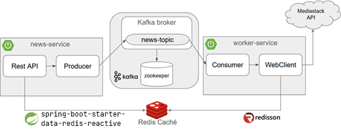

# [Comunicación asíncrona entre microservicios usando SpringBoot 3 con Kafka, Redis y Docker](https://www.youtube.com/watch?v=kIc3ORaZM-I)

---

## Arquitectura del proyecto

La solución se compone de dos microservicios que se comunican de manera asíncrona mediante `Kafka`, y que utilizan un
`Redis` compartido como `sistema de caché`.

### 1. News Service

- Expone una `API REST` para que los clientes consulten noticias.
- Flujo:
    - Revisa primero si la noticia solicitada se encuentra en `Redis`.
    - Si existe en caché → responde inmediatamente al cliente.
    - Si no existe en caché → produce un mensaje en `Kafka (news-topic)` indicando que debe obtenerse esa noticia.

### 2. Worker Service

- Está suscrito al topic `news-topic`.
- Flujo:
    - Escucha el mensaje enviado por el `news-service`.
    - Verifica en `Redis` si ya existe la noticia.
    - Si no está → consulta la API externa `Mediastack`.
    - Guarda la respuesta obtenida en `Redis`, quedando disponible para futuras consultas.

#### 3. Redis (único y compartido)

- Ambos servicios se conectan a la misma instancia de `Redis`, que actúa como caché centralizada.
- Permite que:
    - El `news-service` pueda responder rápidamente si la noticia ya fue procesada.
    - El `worker-service` guarde los resultados para que luego el `news-service` los entregue a los clientes.



### Nota sobre la integración con Redis

En este proyecto, ambos microservicios se conectan a la misma instancia de `Redis`, pero cada uno utiliza un cliente
diferente para propósitos de práctica y aprendizaje:

- `News Service`. Se conecta a `Redis` utilizando la dependencia `spring-boot-starter-data-redis-reactive`, la cual
  internamente emplea el cliente `Lettuce`. Esta elección está alineada con el contenido del curso principal, ya que se
  centra en trabajar con `Spring Data Redis` en su variante reactiva.


- `Worker Service`. En este caso `no se usa` `Spring Data Redis Reactive`. En su lugar, se integra `Redis` a través de
  `redisson-spring-boot-starter`, aprovechando el cliente `Redisson`. Esta decisión se tomó como parte de la práctica
  de un curso previo de `Redis`, lo que permite explorar un enfoque alternativo de conexión y manejo de datos en
  `Redis`.

De esta forma, aunque ambos microservicios comparten la misma instancia de `Redis` como sistema de caché centralizado,
cada uno lo hace con un cliente distinto, lo que enriquece el aprendizaje y la comparación entre enfoques.

## Creando proyecto: [news-service](https://start.spring.io/#!type=maven-project&language=java&platformVersion=3.5.5&packaging=jar&jvmVersion=21&groupId=dev.magadiflo&artifactId=news-service&name=news-service&description=Demo%20project%20for%20Spring%20Boot&packageName=dev.magadiflo.news.app&dependencies=webflux,lombok,data-redis-reactive,kafka,validation)

Creamos el proyecto `news-service` desde spring initializr con las siguientes dependencias.

````xml
<!--Spring Boot 3.5.5-->
<!--Java 21-->
<dependencies>
    <dependency>
        <groupId>org.springframework.boot</groupId>
        <artifactId>spring-boot-starter-data-redis-reactive</artifactId>
    </dependency>
    <dependency>
        <groupId>org.springframework.boot</groupId>
        <artifactId>spring-boot-starter-validation</artifactId>
    </dependency>
    <dependency>
        <groupId>org.springframework.boot</groupId>
        <artifactId>spring-boot-starter-webflux</artifactId>
    </dependency>
    <dependency>
        <groupId>org.springframework.kafka</groupId>
        <artifactId>spring-kafka</artifactId>
    </dependency>

    <dependency>
        <groupId>org.projectlombok</groupId>
        <artifactId>lombok</artifactId>
        <optional>true</optional>
    </dependency>
    <dependency>
        <groupId>org.springframework.boot</groupId>
        <artifactId>spring-boot-starter-test</artifactId>
        <scope>test</scope>
    </dependency>
    <dependency>
        <groupId>io.projectreactor</groupId>
        <artifactId>reactor-test</artifactId>
        <scope>test</scope>
    </dependency>
    <dependency>
        <groupId>org.springframework.kafka</groupId>
        <artifactId>spring-kafka-test</artifactId>
        <scope>test</scope>
    </dependency>
</dependencies>
````

> `Nota`: usamos `spring-boot-starter-data-redis-reactive` porque `WebFlux` está basado en el paradigma reactivo. Esto
> garantiza operaciones no bloqueantes también en el acceso a `Redis`.

## Configuración de News Service

Definimos las configuraciones básicas para que nuestro `news-service` pueda conectarse a `Kafka` y a `Redis`.

````yml
server:
  port: 8080
  error:
    include-message: always

spring:
  application:
    name: news-service
  kafka:
    bootstrap-servers: ${KAFKA_BOOTSTRAP_SERVERS:localhost:9092}
  data:
    redis:
      host: ${REDIS_HOST:localhost}
      port: ${REDIS_PORT:6379}
      username: ${REDIS_USERNAME:userdev}
      password: ${REDIS_PASSWORD:pass123}
````

Explicación:

- `spring.kafka.bootstrap-servers`: indica la dirección de los `brokers de Kafka`. Si la variable de entorno
  `KAFKA_BOOTSTRAP_SERVERS` no es definida, por defecto usará la dirección `localhost:9092`.
- `spring.data.redis`: define las credenciales de acceso a `Redis`. También definimos valores por defecto si las
  variables de entorno no son definidas.

## Configuración de Producer y Topic en Kafka

Para que el `News Service` pueda publicar mensajes en `Kafka`, es necesario configurar un `Producer` y definir el
`Topic` donde se enviarán dichos mensajes.

A continuación, se muestran las clases de configuración:

### Configuración del Producer

En esta clase se define el `ProducerFactory` y el `KafkaTemplate`.

- El `ProducerFactory` se encarga de crear instancias de productores con las propiedades definidas.
- El `KafkaTemplate` es el componente que abstrae y simplifica el envío de mensajes a `Kafka`.

````java

@Configuration
public class KafkaProducerConfig {

    @Value("${spring.kafka.bootstrap-servers}")
    private String bootstrapServers;

    // Propiedades del Producer
    public Map<String, Object> producerConfig() {
        Map<String, Object> props = new HashMap<>();
        props.put(ProducerConfig.BOOTSTRAP_SERVERS_CONFIG, this.bootstrapServers);
        props.put(ProducerConfig.KEY_SERIALIZER_CLASS_CONFIG, StringSerializer.class);
        props.put(ProducerConfig.VALUE_SERIALIZER_CLASS_CONFIG, StringSerializer.class);
        return props;
    }

    // Crea el ProducerFactory
    @Bean
    public ProducerFactory<String, String> producerFactory() {
        return new DefaultKafkaProducerFactory<>(this.producerConfig());
    }

    // Define el KafkaTemplate para enviar mensajes
    @Bean
    public KafkaTemplate<String, String> kafkaTemplate(ProducerFactory<String, String> producerFactory) {
        return new KafkaTemplate<>(producerFactory);
    }
}
````

### Definiendo constantes

En esta clase de utilidad creamos las constantes que estaremos usando en nuestra aplicación.

````java

@UtilityClass
public class Constants {
    public static final String TOPIC_NAME = "news-topic";
    public static final String DATE_FORMAT = "^\\d{4}-\\d{2}-\\d{2}$";
    public static final String DATE_NOT_BLANK_MESSAGE = "El parámetro de solicitud de fecha no puede estar vacío o nulo";
    public static final String DATE_PATTERN_MESSAGE = "La fecha debe estar en el formato yyyy-MM-dd";
    public static final String DATA_FOUND_MESSAGE = "Datos encontrados";
    public static final String DATA_NOT_FOUND_MESSAGE = "La noticia solicitada para la fecha [%s] aún no está disponible. Por favor, intente nuevamente en unos momentos";
}
````

### Configuración del Topic

En esta clase se define el topic `news-topic`, el cual será creado automáticamente al iniciar la aplicación si no
existe en el cluster de `Kafka`.

````java

@Configuration
public class KafkaTopicConfig {
    @Bean
    public NewTopic generateTopic() {
        return TopicBuilder.name(Constants.TOPIC_NAME).build();
    }
}
````

> 📌 `Nota`: Esta configuración es suficiente para entornos de desarrollo o pruebas. En entornos productivos, es
> recomendable especificar explícitamente el `número de particiones` y `réplicas` para garantizar escalabilidad y
> tolerancia a fallos.

## Ejemplo de respuesta JSON del servicio externo (Mediastack)

El servicio externo `Mediastack`, que consumiremos en el `worker-service`, nos retorna la siguiente estructura
JSON cuando realizamos la consulta a su API, pasándole dinámicamente el parámetro `date`:

````bash
$ https://api.mediastack.com/v1/news?access_key=922887e602f7b3a4cdebdd6b3fd7a2c6&limit=5&countries=pe&date=2025-09-22
````

````json
{
  "pagination": {
    "limit": 5,
    "offset": 0,
    "count": 5,
    "total": 128
  },
  "data": [
    {
      "author": "Paolo Valdivia",
      "title": "“The Mandalorian and Grogu”: Primer tráiler oficial",
      "description": "Disney y Lucasfilm lanzaron el primer tráiler de “The Mandalorian and Grogu”, la película que traerá de regreso a Pedro Pascal como Din Djarin junto a Grogu. El filme, dirigido por Jon Favreau, se estrena el 22 de mayo de 2026 y ya reveló reparto, trama y sorpresas para los fans de Star Wars.",
      "url": "https://elcomercio.pe/saltar-intro/noticias/the-mandalorian-and-grogu-primer-trailer-oficial-star-wars-noticia/",
      "source": "elcomercio",
      "image": "https://elcomercio.pe/resizer/v2/JZHCGGFOWVC3FFD7NWQCTFP4KA.webp?width=3840&height=2160&auth=717b4ff9458d46d4cfdada7e0117f2b272718725c83b1be44e44c185e1e6994b&smart=true",
      "category": "general",
      "language": "es",
      "country": "pe",
      "published_at": "2025-09-22T16:31:56+00:00"
    },
    {
      "author": "Diego Aquino (Lab Universitario EC)",
      "title": "Obesidad infantil ya supera al bajo peso en el mundo y amenaza a más de un millón de niños en el Perú",
      "description": "UNICEF advierte que más de un millón de niños peruanos vivirán con obesidad en 2030. Hoy, 4 de cada 10 escolares ya presentan exceso de peso.",
      "url": "https://elcomercio.pe/lima/sucesos/obesidad-infantil-en-peru-4-de-cada-10-escolares-en-riesgo-noticia/",
      "source": "elcomercio",
      "image": "https://elcomercio.pe/resizer/v2/6KV22BVQPZHSHOIMVLVQC7CRA4.jpg?width=600&height=315&auth=927e0c04ae20bc41a5dacbfc0c403574b027bf498b98e7d5dbdda0f3bedee214&smart=true",
      "category": "general",
      "language": "es",
      "country": "pe",
      "published_at": "2025-09-22T16:22:00+00:00"
    },
    {
      "author": "Pierina Denegri Davies",
      "title": "¿Viajas a Santiago de Chile? Provecho recorrió la ciudad y armó una guía para saborear lo mejor de su cocina",
      "description": "Erizos, centolla, completos, chorrillanas y más: una guía de restaurantes y espacios para comer bien y variado en la capital chilena.",
      "url": "https://elcomercio.pe/provecho/tendencias/donde-comer-en-santiago-de-chile-restaurantes-brunchs-y-sabores-locales-que-valen-la-pena-noticia/",
      "source": "elcomercio",
      "image": "https://elcomercio.pe/resizer/v2/QDKXN6JJHRFGFC5NUVG45UXNAM.png?width=1200&height=810&auth=9b75dc5875e9bd88aecee6a913b73c7d87527397b914b2c206eb89ef9ddf4f62&smart=true",
      "category": "general",
      "language": "es",
      "country": "pe",
      "published_at": "2025-09-22T16:17:03+00:00"
    },
    {
      "author": "Pierina Denegri Davies",
      "title": "De la TV a una casona en Bellavista: así es Lote 10, el huarique donde el chef Israel Laura logró su reencuentro con la cocina",
      "description": "En una casa familiar convertida en restaurante, el chef Israel Laura busca ofrecer una variada oferta de preparaciones suculentas. Conchas al miso, patito parrillero y una cata de piscos son parte de la experiencia que te invitamos a conocer en esta nota.",
      "url": "https://elcomercio.pe/provecho/restaurantes/lote-10-el-huarique-donde-el-chef-israel-laura-explora-su-amor-por-la-gastronomia-y-el-pisco-callao-noticia/",
      "source": "elcomercio",
      "image": "https://elcomercio.pe/resizer/v2/XDJ4HQT6RBGNTPFOJU7HWIMV5Y.png?width=1200&height=810&auth=fe400f43e2a8f9b879497bdd84600b9015759e7ab8f097cd57cf76f4af029069&smart=true",
      "category": "general",
      "language": "es",
      "country": "pe",
      "published_at": "2025-09-22T16:16:45+00:00"
    },
    {
      "author": "Redacción Diario Correo",
      "title": "Cusco: suspenden trenes entre Cusco y Ollantaytambo por paro en Anta",
      "description": "Cusco: suspenden trenes entre Cusco y Ollantaytambo por paro en Anta",
      "url": "https://diariocorreo.pe/edicion/cusco/cusco-suspenden-trenes-entre-cusco-y-ollantaytambo-por-paro-en-anta-noticia/",
      "source": "diariocorreo",
      "image": "https://diariocorreo.pe/resizer/v2/UBZBU772ANCF7E3OSGCHOJCS6I.jpg?width=1200&height=804&auth=1eae6fafa0405fbbab774b2fe29a2684cb296faac59ffb4d1e6676cdeebf94c6&smart=true",
      "category": "general",
      "language": "es",
      "country": "pe",
      "published_at": "2025-09-22T16:12:56+00:00"
    }
  ]
}
````

`Nota`: este JSON será almacenado en `Redis` (por el `worker-service`) y posteriormente consumido desde el
`news-service`.

## Definición de DTOs para mapear la respuesta

A partir de la estructura anterior definimos los siguientes DTOs, que representan de manera tipada la información:

````java
public record Pagination(int limit,
                         int offset,
                         int count,
                         int total) {
}
````

````java
public record NewsItem(String author,
                       String title,
                       String description,
                       String url,
                       String source,
                       String image,
                       String category,
                       String language,
                       String country,
                       @JsonProperty("published_at")
                       String publishedAt) {
}
````

````java
public record NewsResponse(Pagination pagination,
                           @JsonProperty("data")
                           List<NewsItem> items) {
}
````

De esta forma queda claro:

- El ejemplo real del JSON externo.
- El propósito (`Redis` + `consumo en otro servicio`).
- La representación tipada en DTOs.

## Configuración de Redis en `news-service`

En el `News Service` usamos `Spring Data Redis (reactive)` con `Lettuce` para interactuar con `Redis` de forma
no bloqueante — ideal cuando trabajamos con `Spring WebFlux`.

En esta configuración tipamos el `ReactiveRedisOperations` con el DTO `NewsResponse`
(la estructura que recibimos de la API externa), de modo que `Redis` almacene y devuelva objetos fuertemente tipados
(`JSON`).

````java

@Configuration
public class RedisConfig {
    @Value("${spring.data.redis.host}")
    private String redisHost;

    @Value("${spring.data.redis.port}")
    private Integer redisPort;

    @Value("${spring.data.redis.username}")
    private String redisUsername;

    @Value("${spring.data.redis.password}")
    private String redisPassword;

    // Configuración de conexión
    @Bean("reactiveRedisConnectionFactory")
    public ReactiveRedisConnectionFactory reactiveRedisConnectionFactory() {
        var config = new RedisStandaloneConfiguration();
        config.setHostName(Objects.requireNonNull(this.redisHost));
        config.setPort(Objects.requireNonNull(this.redisPort));
        config.setUsername(Objects.requireNonNull(this.redisUsername));
        config.setPassword(Objects.requireNonNull(this.redisPassword));
        return new LettuceConnectionFactory(config);
    }

    // Configuración del template reactivo con serializadores
    @Bean
    public ReactiveRedisOperations<String, NewsResponse> reactiveRedisOperations(@Qualifier("reactiveRedisConnectionFactory") ReactiveRedisConnectionFactory factory) {
        // Serializer para valores (NewsResponse -> JSON)
        var valueSerializer = new Jackson2JsonRedisSerializer<>(NewsResponse.class);

        // Serializer para las keys (strings legibles en Redis)
        var keySerializer = new StringRedisSerializer();

        var context = RedisSerializationContext.<String, NewsResponse>newSerializationContext(keySerializer)
                .value(valueSerializer)
                .hashKey(keySerializer)
                .hashValue(valueSerializer)
                .build();

        return new ReactiveRedisTemplate<>(factory, context);
    }
}
````

Explicación paso a paso

1. `Propiedades externas`
    - `spring.data.redis.host` → Dirección del servidor Redis.
    - `spring.data.redis.port` → Puerto de Redis.
    - `spring.data.redis.username` → Usuario ACL configurado en Redis.
    - `spring.data.redis.password` → Contraseña (si está configurada en Redis).

   Estas propiedades se inyectan desde el `application.yml`.

2. `ReactiveRedisConnectionFactory`
    - Se crea una instancia de `RedisStandaloneConfiguration` para indicar `host`, `puerto`, `username` y `password`.
    - Se usa `LettuceConnectionFactory`, que es el driver por defecto recomendado para `Redis` en entornos reactivos.
    - Este `ConnectionFactory` será la encargada de abrir conexiones reactivas hacia Redis.
   > `Spring Boot` crea automáticamente un bean llamado `redisConnectionFactory` como parte de su autoconfiguración.
   > Al definir nuestro propio bean `reactiveRedisConnectionFactory`, se generan dos candidatos del mismo tipo, lo que
   > provoca ambigüedad al momento de inyectarlos. Para resolverlo, usamos:
   >
   > - `@Bean("reactiveRedisConnectionFactory")`: asigna un nombre explícito al bean personalizado.
   > - `@Qualifier("reactiveRedisConnectionFactory")`: indica claramente cuál bean debe inyectarse en
       `reactiveRedisOperations`.
   >
   > Esto evita conflictos y garantiza que se use la configuración reactiva definida por nosotros, en lugar de la
   > conexión estándar que Spring crea por defecto.


3. `ReactiveRedisOperations`
    - Usamos en `ReactiveRedisOperations<String, NewsResponse>` el `NewsResponse` en lugar de `Object`.
    - Ventajas: tipado fuerte, sin cast en las capas superiores, mejor legibilidad y seguridad en tiempo de compilación.
    - `Jackson2JsonRedisSerializer<NewsResponse>` → serializa los `valores` como `JSON` (y deserializa al leer).
    - `StringRedisSerializer` para las `keys` → las claves en `Redis` serán legibles (`news:2025-09-22` por ejemplo) en
      lugar de serializaciones binarias/JSON.

4. `Compatibilidad con worker-service (Redisson)`
    - Para que el `worker-service` (que usa `Redisson`) y el `news-service` (que usa `Spring Data Redis`) sean
      interoperables sobre la misma clave/valor en `Redis`, ambos deben usar JSON y el mismo formato de serialización.
    - En `Redisson` configura `TypedJsonJacksonCodec(NewsResponse.class)` o `JsonJacksonCodec` para que `Redisson`
      escriba JSON compatible con `Jackson` en `Spring Data Redis`.

En pocas palabras:

- `Keys` → guardadas como String.
- `Values` → guardados en formato JSON (gracias a `Jackson`).

## Creación del DAO para acceder a Redis

Para mantener una separación clara entre la lógica de negocio y el acceso a datos, se implementa un
`DAO (Data Access Object)` que encapsula las operaciones contra `Redis`. De esta forma, la aplicación puede
interactuar con la caché sin acoplarse directamente a la `API` de `ReactiveRedisOperations`.

### Interfaz NewsDao

La interfaz define las operaciones disponibles para acceder a las noticias en `Redis`. En este caso, únicamente se
consulta si existe una noticia asociada a una fecha específica.

````java
public interface NewsDao {
    Mono<NewsResponse> getNews(String date);
}
````

- `Mono<NewsResponse>` → dado que estamos en un contexto reactivo, el método devuelve un `Mono`, que representa un
  valor asíncrono (puede contener la noticia o estar vacío si no existe en `Redis`).
- `String date` → se usa la fecha como parte de la clave en `Redis`.

### Implementación NewsDaoImpl

La implementación utiliza el `ReactiveRedisOperations<String, NewsResponse>` configurado previamente para interactuar
con `Redis` de manera tipada.

````java

@RequiredArgsConstructor
@Repository
public class NewsDaoImpl implements NewsDao {

    private final ReactiveRedisOperations<String, NewsResponse> reactiveRedisOperations;
    private static final String KEY_NEWS_REDIS = "news:%s";

    @Override
    public Mono<NewsResponse> getNews(String date) {
        return this.reactiveRedisOperations.opsForValue().get(KEY_NEWS_REDIS.formatted(date));
    }

}
````

- `@Repository` → marca la clase como componente de acceso a datos.
- `@RequiredArgsConstructor (Lombok)` → genera automáticamente un constructor con los argumentos final, en este caso
  `reactiveRedisOperations`.
- `ReactiveRedisOperations<String, NewsResponse>` → está tipado con `NewsResponse`, lo que permite trabajar directamente
  con el DTO sin necesidad de casting ni pérdida de información en la serialización.
- `KEY_NEWS_REDIS` → define un namespace en Redis (`news:<fecha>`), lo que organiza mejor las claves y previene posibles
  colisiones con otros datos.
- `opsForValue().get(KEY_NEWS_REDIS.formatted(date))` → recupera el valor de Redis según la clave construida. Por
  ejemplo: `news:2025-09-16`.

En pocas palabras:

- Clave en Redis → `news:<fecha>`
- Valor en Redis → instancia de `NewsResponse` serializada en `JSON`

## Servicio de Noticias (`NewsService`)

El servicio se encarga de:

1. Consultar `Redis` para ver si la noticia solicitada ya está disponible.
2. Si la encuentra `(cache HIT)` → devolverla al cliente.
3. Si no existe `(cache MISS)` → publicar un mensaje en `Kafka` para que el `worker-service` procese la solicitud y
   obtenga la noticia desde la API externa.

### Interfaz

````java
public interface NewsService {
    Mono<NewsResponse> getNews(String date);

    Mono<Void> publishToMessageBroker(String date);
}
````

- `getNews(String date)`: consulta si existe la noticia en `Redis`, y si no, dispara el flujo de publicación a `Kafka`.
- `publishToMessageBroker(String date)`: envía un mensaje al `topic` de `Kafka` con la fecha solicitada.

### Implementación

````java

@Slf4j
@RequiredArgsConstructor
@Service
public class NewsServiceImpl implements NewsService {

    private final KafkaTemplate<String, String> kafkaTemplate;
    private final NewsDao newsDao;

    @Override
    public Mono<NewsResponse> getNews(String date) {
        return this.newsDao.getNews(date)
                .doOnNext(value -> log.info("Cache HIT - Obteniendo desde Redis para fecha: {}", value))
                .switchIfEmpty(Mono.defer(() -> {
                    log.info("Cache MISS - Publicando fecha {} en Kafka", date);
                    return this.publishToMessageBroker(date);
                }));
    }

    @Override
    public Mono<Void> publishToMessageBroker(String date) {
        Message<String> message = MessageBuilder
                .withPayload(date)
                .setHeader(KafkaHeaders.TOPIC, Constants.TOPIC_NAME)
                .build();
        return Mono.fromFuture(() -> this.kafkaTemplate.send(message))
                .then();
    }
}
````

Explicación del flujo

1. `newsDao.getNews(date)` → busca la noticia en Redis.
2. Si existe:
    - Se loguea `Cache HIT`.
    - Se devuelve directamente el valor encontrado.
3. Si no existe:
    - Se loguea Cache MISS.
    - Se invoca `publishToMessageBroker(date)`, que construye un mensaje y lo envía a `Kafka`.

## 🧭 Catálogo de errores de negocio en APIs (`ErrorCatalog`)

En arquitecturas modernas de backend, especialmente en APIs REST, es común complementar los códigos HTTP estándar
con un `catálogo de errores de negocio`. Este catálogo permite identificar con precisión el origen del error, facilitar
la trazabilidad en observabilidad, y ofrecer mensajes claros y consistentes a los consumidores de la API.

### 🎯 Propósito del catálogo

El `enum` `ErrorCatalog` centraliza los errores que pueden ocurrir en la lógica de negocio o en validaciones
específicas. Cada entrada del catálogo contiene:

- `code`: Identificador único del error, siguiendo una convención definida por el equipo (e.g. `NEWS_MS_001`).
- `message`: Descripción legible del error, útil para mostrar al cliente o registrar en logs.

Esto permite desacoplar los errores técnicos del protocolo HTTP de los errores funcionales del dominio.

### 🧱 Ejemplo de implementación

````java

@Getter
@RequiredArgsConstructor
public enum ErrorCatalog {

    INVALID_PARAMETERS("NEWS_MS_001", "Parámetro de solicitud de fecha no válido"),
    INTERVAL_SERVER_ERROR("NEWS_MS_002", "Error Interno del Servidor");

    private final String code;
    private final String message;
}
````

### 🔍 Diferencias entre errores HTTP y errores de negocio

| Aspecto                        | Código HTTP (`400`, `500`, etc.) | Código de catálogo (`NEWS_MS_001`)             |
|--------------------------------|----------------------------------|------------------------------------------------|
| Propósito                      | Indicar tipo de error técnico    | Identificar error específico de negocio        |
| Granularidad                   | Limitada                         | Detallada y extensible                         |
| Trazabilidad en observabilidad | Difícil de rastrear sin contexto | Fácil de rastrear en logs, dashboards, alertas |
| Mensaje para el cliente        | Genérico                         | Personalizados y claros                        |
| Mantenibilidad                 | No versionable                   | Versionable y documentable                     |

### 📦 Ejemplo de respuesta en API

Esta estructura puede acompañar un código `HTTP 400 Bad Request`, pero el code interno permite identificar el error
exacto en dashboards, logs o alertas.

````json
{
  "code": "NEWS_MS_001",
  "message": "Parámetro de solicitud de fecha no válido"
}
````

### 🛠️ Buenas prácticas de diseño

- `Convención de códigos`: Usa prefijos por módulo (NEWS_MS, USER_MS, etc.) y numeración secuencial.
- `Centralización`: Mantén el catálogo en un único enum o agrúpalo por dominio si crece demasiado.
- `Versionado`: Documenta los cambios en el catálogo para evitar rupturas en clientes.
- `Integración con observabilidad`: Expón el code en logs estructurados, trazas y métricas.
- `Mensajes legibles`: Evita mensajes técnicos crípticos, prioriza claridad para el consumidor.

## DTOs de Respuesta

Para garantizar que la API tenga un contrato consistente tanto en respuestas exitosas como en errores, definimos los
siguientes DTOs:

### 1. Tipos de Error (ErrorType)

- `FUNCTIONAL` → Por ejemplo, cuando un parámetro no es válido o una noticia solicitada no existe.
- `SYSTEM` → Por ejemplo, fallas en la comunicación con `Kafka`, `Redis`, o errores internos inesperados.

````java
public enum ErrorType {
    FUNCTIONAL, // Errores relacionados con reglas de negocio
    SYSTEM      // Errores relacionados con el sistema o infraestructura
}
````

### 2. Respuesta exitosa (DataResponse)

````java
public record DataResponse<T>(String message,
                              Boolean status,
                              @JsonInclude(JsonInclude.Include.NON_NULL)
                              T data) {
}
````

- `message` → mensaje genérico para el cliente (ej: "Operación exitosa").
- `status` → indica si la operación fue correcta (true/false).
- `data` → el contenido real de la respuesta (puede ser un DTO, lista, etc.).
- ⚠️ `Si data es null`, no se incluye en el JSON gracias a `@JsonInclude(JsonInclude.Include.NON_NULL)`.

### 3. Respuesta de error (ErrorResponse)

````java
public record ErrorResponse(String code,
                            String message,
                            ErrorType errorType,
                            List<String> details,
                            LocalDateTime timestamp) {
}
````

- `code` → código de error definido en el catálogo (`NEWS_MS_001`, `NEWS_MS_002`, etc.).
- `message` → descripción breve y clara del error.
- `errorType` → indica si es un error `FUNCTIONAL` o `SYSTEM`.
- `details` → lista de detalles adicionales (ej. campos inválidos).
- `timestamp` → momento exacto en que ocurrió el error.

### ✅ Beneficios de este diseño

- Estandariza las respuestas, tanto exitosas como de error.
- Facilita el consumo de la API, ya que el cliente sabe siempre qué campos esperar.
- Permite extender fácilmente la estructura (ej. agregar un campo de requestId en el futuro para trazabilidad).

## Excepciones personalizadas

En la aplicación definimos excepciones propias para representar errores de negocio de forma clara y controlada. Esto
permite separar los errores funcionales de los errores técnicos, y facilitar el manejo centralizado de excepciones en
la capa de controladores.

### 1. Excepción específica: `NewsNotFoundException`

````java
public class NewsNotFoundException extends RuntimeException {
    public NewsNotFoundException(String date) {
        super(Constants.DATA_NOT_FOUND_MESSAGE.formatted(date));
    }
}
````

- Extiende de `RuntimeException`, lo que la hace no chequeada `(unchecked)`.
- Se lanza cuando una noticia no existe ni en `Redis` ni en la `API externa`.
- Usa el mensaje predefinido en `Constants.DATA_NOT_FOUND_MESSAGE`, formateado con la fecha solicitada.

### 2. Fábrica de excepciones: `ApplicationExceptions`

````java

@NoArgsConstructor(access = AccessLevel.PRIVATE)
public class ApplicationExceptions {
    public static <T> Mono<T> newsNotFound(String date) {
        return Mono.error(() -> new NewsNotFoundException(date));
    }
}
````

- Clase utilitaria y estática (constructor privado) para centralizar la creación de errores en formato reactivo
  `(Mono.error)`.
- `newsNotFound(String date)` retorna un `Mono.error` que emite la excepción `NewsNotFoundException`.

### ✅ Beneficios de este enfoque

- Separa las excepciones de negocio (`NewsNotFound`) de los errores técnicos.
- Estandariza la forma en que se generan errores reactivos (`ApplicationExceptions`).
- Facilita el futuro manejo global con un `@RestControllerAdvice`, devolviendo un `ErrorResponse` consistente al
  cliente.

## Lanzando excepción en servicio `NewsServiceImpl`

Cuando una noticia no se encuentra en `Redis`, ocurren dos acciones encadenadas:

1. Se publica un mensaje en el topic de `Kafka`, para que el `worker-service` procese la solicitud.
2. Se lanza una excepción `NewsNotFoundException`, que posteriormente será capturada por nuestro handler global de
   errores y devuelta al cliente en un formato consistente (`ErrorResponse`).

De esta forma:

- El cliente recibe una respuesta inmediata, sin quedar bloqueado esperando a `Kafka`.
- El `worker-service` se encarga en segundo plano de consultar la API externa y guardar el resultado en `Redis` para
  futuras peticiones.

````java

@Slf4j
@RequiredArgsConstructor
@Service
public class NewsServiceImpl implements NewsService {

    private final KafkaTemplate<String, String> kafkaTemplate;
    private final NewsDao newsDao;

    @Override
    public Mono<NewsResponse> getNews(String date) {
        return this.newsDao.getNews(date)
                .doOnNext(value -> log.info("Cache HIT - Obteniendo desde Redis para fecha: {}", value))
                .switchIfEmpty(Mono.defer(() -> {
                    log.info("Cache MISS - Publicando fecha {} en Kafka", date);
                    return this.publishToMessageBroker(date) // Cuando termine la publicación → lanzamos excepción
                            .then(ApplicationExceptions.newsNotFound(date));
                }));
    }

    @Override
    public Mono<Void> publishToMessageBroker(String date) {
        Message<String> message = MessageBuilder
                .withPayload(date)
                .setHeader(KafkaHeaders.TOPIC, Constants.TOPIC_NAME)
                .build();
        return Mono.fromFuture(() -> this.kafkaTemplate.send(message))
                .then();
    }
}
````

### 🔎 Puntos clave

- `Mono.defer(...)`: garantiza que la publicación en `Kafka` y la excepción solo se ejecuten si el flujo viene vacío
  (cache miss).
- `.then(ApplicationExceptions.newsNotFound(date))`: asegura que la excepción se dispare después de publicar el mensaje.
- Patrón `Cache-Aside + Event-driven`:
    - Si la noticia existe → se devuelve directamente desde Redis.
    - Si no existe → se dispara el flujo asíncrono y el cliente recibe un mensaje claro de que la solicitud está en
      proceso.

## Crea controlador `NewsController`

El controlador expone el endpoint para consultar noticias. Utiliza `NewsService` y retorna un `DataResponse` tipado
para mantener consistencia en las respuestas.

````java

@Slf4j
@RequiredArgsConstructor
@RestController
@RequestMapping(path = "/api/v1/news")
public class NewsController {

    private final NewsService newsService;

    @GetMapping
    public Mono<ResponseEntity<DataResponse<NewsResponse>>> getNews(@NotBlank(message = Constants.DATE_NOT_BLANK_MESSAGE)
                                                                    @Pattern(regexp = Constants.DATE_FORMAT, message = Constants.DATE_PATTERN_MESSAGE)
                                                                    @RequestParam(required = false) String date) {
        return this.newsService.getNews(date)
                .map(newsData -> ResponseEntity.ok(new DataResponse<>(Constants.DATA_FOUND_MESSAGE, Boolean.TRUE, newsData)));
    }

}
````

🔎 Puntos clave

- `Validación de parámetros`
    - Aunque el parámetro `date` es obligatorio desde el punto de vista funcional, se define con `required = false`.
    - Esto permite que `Bean Validation` (`@NotBlank`, `@Pattern`) maneje la validación en lugar de que `Spring WebFlux`
      lo rechace automáticamente.
        - Si usáramos `required = true` (valor por defecto), cuando no enviemos el parámetro date en el request,
          `Spring` lanzaría una excepción antes de que nuestras validaciones con `Bean Validation` pudieran aplicarse.
        - De esta forma tenemos control total sobre los mensajes de error y aseguramos que todas las respuestas se
          devuelvan en un formato consistente (`ErrorResponse`).


- `Respuesta uniforme`. El uso de `DataResponse<T>` estandariza la salida.
    - Si existe la noticia en Redis → se devuelve con `status = true` y data poblado.
    - Si no existe → se lanza `NewsNotFoundException`, que más adelante manejaremos en un handler global de excepciones
      para devolver un `ErrorResponse`.

## 🛡️ Manejador global de excepciones

Un `@RestControllerAdvice` nos permite centralizar el manejo de excepciones y devolver respuestas uniformes a los
clientes, siguiendo siempre la misma estructura (`ErrorResponse`).

En este proyecto, tenemos dos escenarios principales:

1. `Errores de validación`: cuando los parámetros enviados al controlador no cumplen las reglas de `Bean Validation`.
2. `Errores inesperados`: cualquier excepción no controlada dentro de la aplicación.

````java

@Slf4j
@RestControllerAdvice
public class GlobalExceptionHandler {

    @ExceptionHandler(HandlerMethodValidationException.class)
    public Mono<ResponseEntity<ErrorResponse>> handleException(HandlerMethodValidationException e) {
        e.getValueResults().forEach(result -> {
            String parameterName = result.getMethodParameter().getParameterName();
            List<String> messageList = result.getResolvableErrors().stream()
                    .map(MessageSourceResolvable::getDefaultMessage)
                    .toList();
            log.warn("{}: {}", parameterName, messageList);
        });

        return Mono.fromSupplier(() -> ResponseEntity
                .badRequest()
                .body(new ErrorResponse(
                        ErrorCatalog.INVALID_PARAMETERS.getCode(),
                        ErrorCatalog.INVALID_PARAMETERS.getMessage(),
                        ErrorType.FUNCTIONAL,
                        Collections.singletonList(e.getMessage()),
                        LocalDateTime.now())
                )
        );
    }

    @ExceptionHandler(Exception.class)
    public Mono<ResponseEntity<ErrorResponse>> handleException(Exception e) {
        log.error("Excepción General: {}", e.getMessage(), e);
        return Mono.fromSupplier(() -> ResponseEntity
                .internalServerError()
                .body(new ErrorResponse(
                        ErrorCatalog.INTERVAL_SERVER_ERROR.getCode(),
                        ErrorCatalog.INTERVAL_SERVER_ERROR.getMessage(),
                        ErrorType.SYSTEM,
                        Collections.singletonList(e.getMessage()),
                        LocalDateTime.now())
                ));
    }

}
````

- `HandlerMethodValidationException`. Este tipo de excepción se lanza cuando la validación ocurre directamente sobre
  parámetros simples del método (por ejemplo, `@RequestParam`) y no se usa `@Validated`.
- 💡 Se recomienda incluir los mensajes de validación por parámetro en el cuerpo de la respuesta para facilitar el
  diagnóstico desde el cliente.

## 🧾 Configura a contenedor de Redis en docker compose

Creamos un archivo `compose.yml` donde definimos el siguiente servicio de redis.

````yml
services:
  s-redis:
    image: redis:8.0.3-alpine
    container_name: c-redis
    restart: unless-stopped
    ports:
      - '6379:6379'
    command: [ "--user userdev >pass123 on allcommands allkeys", "--user default off" ]
````

Esta configuración levanta un contenedor `Redis` con:

- Un usuario ACL llamado `userdev` con contraseña `pass123`.
- Permisos completos: acceso a todos los comandos (`allcommands`) y todas las claves (`allkeys`).
- El usuario `default` está deshabilitado (`default off`) para evitar accesos sin autenticación.

🔐 Seguridad

- Redis exige autenticación desde el arranque.
- Cualquier intento de ejecutar comandos sin `AUTH` resultará en `(error) NOAUTH Authentication required.`.
- Ejemplo de autenticación desde `redis-cli`:
    ````bash
    127.0.0.1:6379> auth userdev pass123
    OK 
    ````

### Diferencia entre `--user` y `ACL SETUSER`

| Contexto                   | Forma                                                 | ¿Cuándo se usa?                                                                                                                                    |
|----------------------------|-------------------------------------------------------|----------------------------------------------------------------------------------------------------------------------------------------------------|
| Arranque del contenedor    | `--user userdev >pass123 on allcommands allkeys`      | Se usa en el `command` de `Docker Compose` para definir usuarios `ACL` al iniciar `Redis`. Redis interpreta esta línea como configuración inicial. |
| Interacción en tiempo real | `ACL SETUSER userdev >pass123 on allcommands allkeys` | Se usa dentro de `redis-cli` para crear o modificar usuarios `ACL` dinámicamente mientras `Redis` está corriendo.                                  |

Ambas formas son equivalentes en funcionalidad, pero se aplican en contextos distintos: una al iniciar Redis, otra
durante su ejecución.

## 🧾 [Configura contenedor de Kafka en docker compose](https://docs.docker.com/guides/kafka/)

> Este apartado fue tomado de la siguiente guía
> [Developing event-driven applications with Kafka and Docker.](https://docs.docker.com/guides/kafka/)

`Apache Kafka`, una plataforma distribuida de streaming de eventos, suele ser la base de las arquitecturas basadas en
eventos. Desafortunadamente, configurar e implementar una instancia propia de `Kafka` para el desarrollo suele ser
complicado. Afortunadamente, `Docker` y los contenedores lo simplifican mucho.

En esta guía, aprenderá a:

- Usar Docker para iniciar un clúster de Kafka
- Conectar una aplicación no contenedorizada al clúster
- Conectar una aplicación contenedorizada al clúster

A partir de `Kafka 3.3`, la implementación de `Kafka` se simplificó enormemente al prescindir de `Zookeeper` gracias
a `KRaft (Kafka Raft)`. Con `KRaft`, configurar una instancia de `Kafka` para el desarrollo local es mucho más
sencillo. A partir del lanzamiento de `Kafka 3.8`, ya está disponible una nueva imagen de Docker nativa de Kafka,
que proporciona un inicio significativamente más rápido y un menor consumo de memoria.

> Esta guía utilizará la imagen de `Apache/Kafka`, ya que incluye numerosos scripts útiles para administrar y trabajar
> con `Kafka`. Sin embargo, puede que prefiera usar la imagen nativa de `Apache/Kafka`, ya que se inicia más rápido y
> requiere menos recursos.

### Definición de los listeners

Para que esto sea más claro, veamos cómo debe configurarse `Kafka` para admitir `dos tipos de conexión`:

1. `Conexiones de host` (aquellas que llegan a través del puerto asignado al host): estas deben conectarse mediante
   `localhost`.
2. `Conexiones de Docker` (aquellas que provienen de las redes Docker): estas no pueden conectarse mediante `localhost`,
   sino mediante el alias de red (o dirección DNS) del `servicio de Kafka`.

Dado que los clientes necesitan dos métodos diferentes para conectarse, se requieren dos oyentes: `HOST` y `DOCKER`.
El listener `HOST` indicará a los clientes que se conecten mediante `localhost:9092`, mientras que el listener `DOCKER`
les indicará que se conecten mediante `s-kafka:9093`. Cabe destacar que esto significa que `Kafka` escucha en ambos
puertos, `9092` y `9093`. Sin embargo, solo el listener del host debe estar expuesto al host.


Para configurar esto, se requiere configuración adicional en el archivo `compose.yaml` de `Kafka`. Una vez que se
sobrescriban algunos valores predeterminados, también se deben especificar otras opciones para que el modo
`KRaft` funcione.

````yml
services:
  s-kafka:
    image: apache/kafka:4.1.0
    container_name: c-kafka
    restart: unless-stopped
    environment:
      # Settings required for KRaft mode
      KAFKA_NODE_ID: 1
      KAFKA_PROCESS_ROLES: broker,controller
      KAFKA_CONTROLLER_LISTENER_NAMES: CONTROLLER
      KAFKA_CONTROLLER_QUORUM_VOTERS: 1@localhost:9091
      # Configure listeners for both docker and host communication
      KAFKA_LISTENERS: CONTROLLER://localhost:9091,HOST://0.0.0.0:9092,DOCKER://0.0.0.0:9093
      KAFKA_ADVERTISED_LISTENERS: HOST://localhost:9092,DOCKER://s-kafka:9093
      KAFKA_LISTENER_SECURITY_PROTOCOL_MAP: CONTROLLER:PLAINTEXT,DOCKER:PLAINTEXT,HOST:PLAINTEXT
      # Listener to use for broker-to-broker communication
      KAFKA_INTER_BROKER_LISTENER_NAME: DOCKER
      # Required for a single node cluster
      KAFKA_OFFSETS_TOPIC_REPLICATION_FACTOR: 1
    ports:
      - '9092:9092'
````

- `KAFKA_NODE_ID: 1`. Identificador único del nodo Kafka en el clúster. En modo `KRaft`, cada nodo debe tener un ID
  distinto.
- `KAFKA_PROCESS_ROLES: broker,controller`. Define los roles que cumple este nodo: `broker` (gestiona mensajes) y
  `controller` (coordina el clúster). En clústeres pequeños, ambos roles pueden coexistir.
- `KAFKA_CONTROLLER_LISTENER_NAMES: CONTROLLER`. Indica qué listener se usará para la comunicación del controller. Debe
  coincidir con uno definido en `KAFKA_LISTENERS`.
- `KAFKA_CONTROLLER_QUORUM_VOTERS: 1@localhost:9091`. Define los votantes del quorum del controller. En este caso, un
  solo nodo (ID 1) escuchando en `localhost:9091`. Es obligatorio en modo `KRaft`.


- `KAFKA_LISTENERS: CONTROLLER://localhost:9091,HOST://0.0.0.0:9092,DOCKER://0.0.0.0:9093`. Define los endpoints donde
  Kafka escuchará conexiones:
    - `CONTROLLER://localhost:9091`: usado internamente por el controller.
    - `HOST://0.0.0.0:9092`: escucha en todas las interfaces del host, permitiendo que tu aplicación en el IDE se
      conecte vía `localhost:9092`.
    - `DOCKER://0.0.0.0:9093`: también escucha en todas las interfaces, pero será usado por otros contenedores que
      acceden vía `s-kafka:9093`.
    - ⚠️ El uso de `0.0.0.0` significa “escuchar en todas las interfaces disponibles”, es decir, aceptar conexiones
      desde cualquier IP que esté conectada al contenedor. Es equivalente a escribir `:9092` o `:9093`.
- `KAFKA_ADVERTISED_LISTENERS: HOST://localhost:9092,DOCKER://s-kafka:9093`. Define cómo Kafka se anuncia a los
  clientes:
    - `HOST://localhost:9092`: para que tu aplicación en el IDE se conecte usando `localhost`.
    - `DOCKER://s-kafka:9093`: para que otros contenedores lo encuentren usando el nombre del servicio (`s-kafka`).
- `KAFKA_LISTENER_SECURITY_PROTOCOL_MAP: CONTROLLER:PLAINTEXT,DOCKER:PLAINTEXT,HOST:PLAINTEXT`. Asocia cada listener
  con el protocolo de seguridad. En este caso, todos usan `PLAINTEXT` (sin `TLS` ni autenticación).
- `KAFKA_INTER_BROKER_LISTENER_NAME: DOCKER`. Kafka usará el listener `DOCKER` para la comunicación interna entre
  brokers. Aunque sea un solo nodo, esta variable es obligatoria en modo `KRaft`.


- `KAFKA_OFFSETS_TOPIC_REPLICATION_FACTOR: 1`. Define cuántas réplicas tendrá el tópico de offsets. En clústeres de un
  solo nodo, debe ser 1 para evitar errores de arranque.

### 🧭 Conectividad según escenario

- Desde el IDE (host): Usa `bootstrap.servers=localhost:9092`
- Desde otro contenedor: Usa `bootstrap.servers=s-kafka:9093`

## Creando proyecto: [worker-service](https://start.spring.io/#!type=maven-project&language=java&platformVersion=3.5.5&packaging=jar&jvmVersion=21&groupId=dev.magadiflo&artifactId=worker-service&name=worker-service&description=Demo%20project%20for%20Spring%20Boot&packageName=dev.magadiflo.worker.app&dependencies=webflux,lombok,kafka)

Creamos el proyecto `worker-service` desde spring initializr con las siguientes dependencias.

````xml
<!--Spring Boot 3.5.5-->
<!--Java 21-->
<dependencies>
    <dependency>
        <groupId>org.springframework.boot</groupId>
        <artifactId>spring-boot-starter-webflux</artifactId>
    </dependency>
    <dependency>
        <groupId>org.springframework.kafka</groupId>
        <artifactId>spring-kafka</artifactId>
    </dependency>

    <!--Agregado manualmente: Cliente Redisson (para conexión a Redis)-->
    <dependency>
        <groupId>org.redisson</groupId>
        <artifactId>redisson-spring-boot-starter</artifactId>
        <version>3.51.0</version>
    </dependency>
    <!--/Agregado manualmente-->
    <dependency>
        <groupId>org.projectlombok</groupId>
        <artifactId>lombok</artifactId>
        <optional>true</optional>
    </dependency>
    <dependency>
        <groupId>org.springframework.boot</groupId>
        <artifactId>spring-boot-starter-test</artifactId>
        <scope>test</scope>
    </dependency>
    <dependency>
        <groupId>io.projectreactor</groupId>
        <artifactId>reactor-test</artifactId>
        <scope>test</scope>
    </dependency>
    <dependency>
        <groupId>org.springframework.kafka</groupId>
        <artifactId>spring-kafka-test</artifactId>
        <scope>test</scope>
    </dependency>
</dependencies>
````

Nota

En este microservicio `no usaremos` `Spring Data Redis Reactive` (como hicimos en `news-service`), sino que
integraremos `Redis` mediante `redisson-spring-boot-starter`.

La elección de `Redisson` se debe a que:

- Proporciona un cliente `Redis` altamente optimizado y no bloqueante.
- Ofrece una API más rica que la de `Spring Data Redis` (ejemplo: `RMap`, `RBucket`, `RList`, `locks distribuidos`,
  `semáforos`, etc.).
- Facilita definir el tipo de dato que se `serializa/deserializa` en `Redis` mediante codecs como
  `TypedJsonJacksonCodec`.
- Permite explorar un enfoque alternativo de integración con `Redis`, lo que complementa la experiencia del curso.
- Además, forma parte de mi experiencia previa: realicé un curso de `Redis` donde se utilizó `Redisson` y me interesa
  poner en práctica lo aprendido. Para referencia, aquí está el enlace al curso:
  [reactive-redis-masterclass](https://github.com/magadiflo/reactive-redis-masterclass).

Esto nos permitirá comparar ambos enfoques (`Spring Data Redis` vs. `Redisson`) y entender mejor sus fortalezas en
distintos escenarios.

